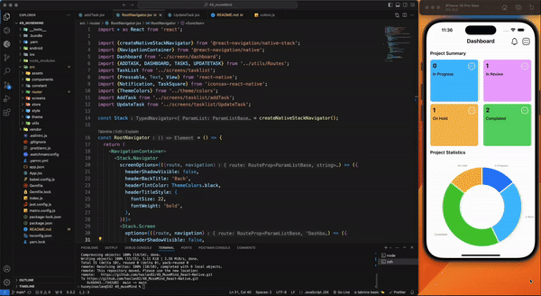

# Task-App with React-Native

🚀 Görev Takip Uygulaması – Verimliliğinizi Yükseltin!

React Native kullanarak geliştirdiğim Görev Takip Uygulaması, kullanıcıların görevlerini etkili bir şekilde yönetmelerine ve ilerlemelerini kolayca izlemelerine yardımcı oluyor. Görev ekleme, güncelleme, silme gibi temel özelliklerin yanı sıra, tamamlanma yüzdesi ve toplam görev istatistikleri gibi analiz araçları sunuyor.

💻 Kullandığım Teknolojiler:
React Native & React: Güçlü ve performanslı bir mobil deneyim
Redux & React-Redux: Durum yönetimi ve veri akışı
React Navigation: Kolay ve hızlı ekran geçişleri
Victory Native & SVG: Görev istatistiklerini görselleştirme
DateTime Pickers: Esnek tarih ve saat seçimi
Amacım, kullanıcı dostu, modern ve işlevsel bir uygulama sunmak.

#ReactNative #MobilUygulama #Front-End #Redux #MobilGeliştirme #JavaScript #react

##  Designed by <a href="https://www.linkedin.com/in/h%C3%BCseyin-aslan-128519203/" target="_blank">Hüseyin ASLAN</a> 

### Kütüphane

victory kütüphanesi için 
 "victory-native": "^37.0.3-next.0" instalation
https://commerce.nearform.com/open-source/victory/docs/api/victory-pie
